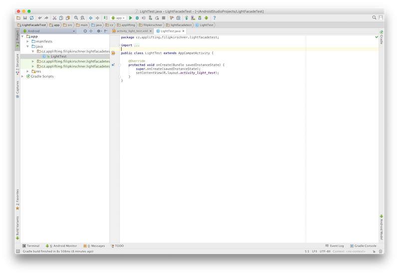
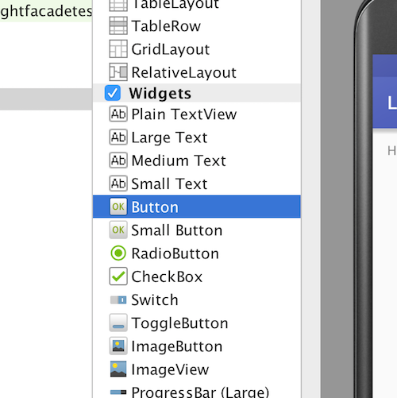
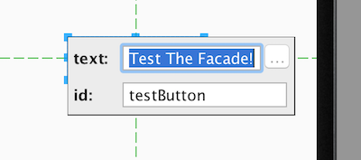

#How to create an Android app to test the Light Facade of FEE CTU

##Motivation

[TBD]

##Before you start

First, you need to get a copy of [Android Studio](https://developer.android.com/studio/install.html) application. This guide is made on Android Studio for Mac, but controls on Windows version are analogical.

For the purposes of this guide it is sufficient to install Android Studio with standard settings.

##Creating a new project

To create a new project, start Android Studio and press button labeled `Start a new Android Studio project`.


Once you press the button the IDE will inquire about properties of the project, mainly name of your new application, company domain and project location. You do not need to change anything, but if you insist on having an awesome app, you should at least change its name. After selecting a perfect name for your app, just click next and move to next step.


Now let's select the SDK we will use to develop our app. For this guide we will use API level 15 which targets 97% of all android phoned (which is considered enough). Click next.


Next up we select the right template for our first activity (the function of our application). For purposes of testing connection to the facade an empty activity suits just fine. Select it and click next.


Last step in preparing of our project is to create Layout File for our first activity. Just tick the box and you are ready to go (click Finish). 


Now the Android Studio prepares an empty project exactly to suit our needs. We are halfway done, so let's get coding!

##Creating interface

After setup, we are presented with a view of our project just like on the image below:



On the left, there is the project browser (used to browse the project) and in the right there is the main window (used to actually create something). So let's go to project navigator and click on a small ▶︎ next to `res` folder. In its subfolders, click again on a small ▶︎ next to `layout` folder. Here resides the xml layout file for your default activity created during the setup. Double-click it to expand it in main window.


As the layout file expands to main window, you can see how the activity will look like once ran on your hardware. Currently there is just a label with obligatory *Hello world* set as its title. In the left side of main window, you can see a list of UI elements you can add to your activity.



This is about the right time to select a Button and drag it to the screen of the phone displayed in right. Once the button is in place, double click it and change its text to *Test The Facade!* and its id to *testButton*. Confirm the change by striking Enter.



And there you have it. Your app has a first element you can interact with. Good job!

##Programming interactions

As we already have a button, we may want to react if the user presses it. This can be done quite easily, so let's go. In project navigator, once again go to your main activity (in our case called `LightTest`) and look at the `onCreate()` function already programmed there. First we need to create a `Button` object and bind an action to when it's clicked. Insert following lines of code right after `setContentView( ... );` command.

```
Button testButton = (Button) findViewById(R.id.testButton);
        if (testButton != null) {
            testButton.setOnClickListener(new View.OnClickListener(){
                public void onClick(View v){
                    //Test the connection to facade here!
                }
            });
        }
```

The moment you paste the code many lines will alertly flick with red-ish colours to indicate that something's wrong. To solve all issues, just add following under the line `import android.os.Bundle;`:

```
import android.view.View;
import android.widget.Button;
```

Now we are completely ready to start integrating the facade.

##Integrating the facade

Hey! Have you noticed the line

```
//Test the connection to facade here!
```

in `onCreate()` function we added in previous step? That's where the magic will happen next.

###How the communication with facade works

[TBD]